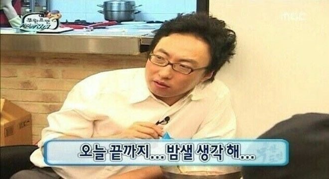

# 서울 7반 APS 스터디 전용 레포

## 규칙
- **(1)** 교수님이 내주는 과제 다하고, 공유 레포에 올리기
    - 목요일에 확인 했을 때, 안 되어 있으면 문제 당 1000원
- **(2)** 만나서 제한 시간 내에 문제(SW 기본 난이도, 또는 A형으로 가는 지름길) 풀기 : 매주 목요일

------
        - SWEA_1231_중위순회
        - SWEA_1232_사칙연산
        - SWEA_1248_공통조상
        - SWEA_2930_힙

        ### 선택 : A형 대비
        - SWEA_1486_장훈이의높은선반
        - SWEA_2817_부분수열의합
        - SWEA_2806_NQueen
        - SWEA_6808_규영이와인영이의카드게임

        - SWEA_2105_디저트카페
        - SWEA_1949_등산로조정
        - SWEA_1767_프로세서연결하기
        - SWEA_1953_탈주범검거

        - 알고리즘 경진대회 문제 6개.

------

* 문제당 1000원

|     이름     |     금액     |     이름     |     금액     |
|:------------:|:------------:|:------------:|:------------:|
|     현수     |   Column 2   |     윤준     |    8000    |
|     민서     |   Column 2   |     성현     |    8000    |
|     보성     |   Column 2   |     혜원     |    5000    |
| **Total**   |   10000      |              |              |

